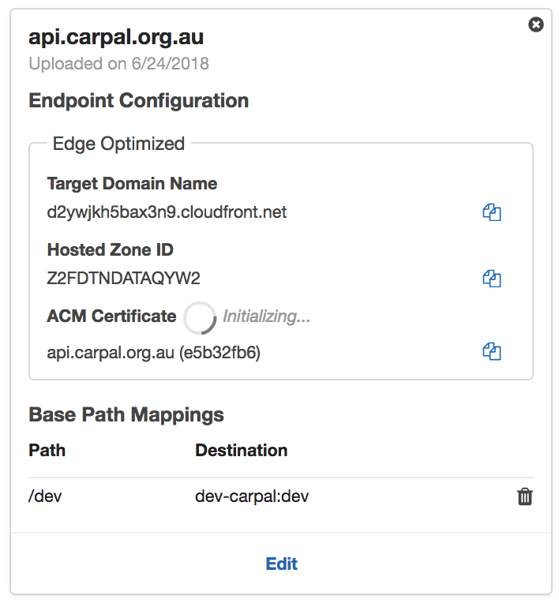

# Services
The services are created with Serverless and a few manual steps.

## Initial Setup

### Serverless
Run the following in the ./infrastructure/services directory to create the API Gateway config and lambdas:
```
npm install
npm install serverless -g
serverless deploy
```

### API Gateway Custom Domain
Services are published on api.carpal.org.au.

This is achieved using:
1. An SSL certificate in North Virginia for the domain
2. A configuration in API Gateway for the custom domain as below:

3. A Route53 entry for api.carpal.org.au is ALIAS'd (like a hidden CNAME) to the above Target Domain Name.

Ref: https://docs.aws.amazon.com/console/apigateway/custom-domains
